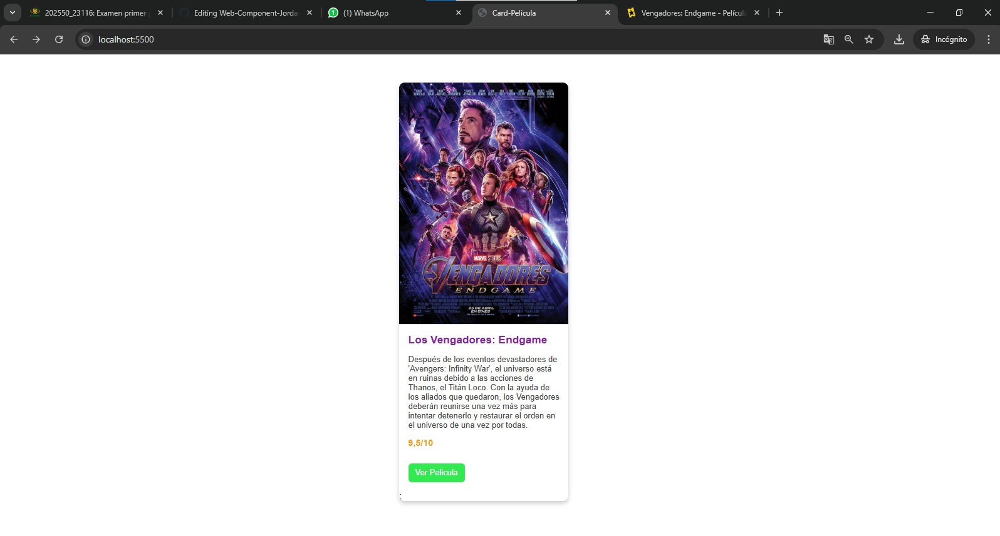

# Componente que incluye póster, nombre, sinopsis y calificación de una película.
El componente da un vistazo a lo que es la presentacion en un card para una pelicula. De la cual este recibe los atributos del componente y muestra el como se veria la pelicula aplicando el estilo y estructura del card.

#Funciones del componente
##getTemplate
Dentro de la funcion tenemos lo que es la plantilla del card para las peliculas, en la cual se puede apreciar que esta dentro de una section, en la misma se puede apreciar los campos que son de imagen, titulo, sinopsis y la valoracion del mismo, añadido tambien un slot que funciona como un boton (usando la etiqueta <a>) que nos dirige a la pagina para ver la pelicula.
##getStyles
Este contiene lo que son los estilos del card, de la cual se esta usando lo que es el host y el slotted para el cambio de estilo, ademas de variables para que se pueda usar de diferentes maneras en cualquier card.

